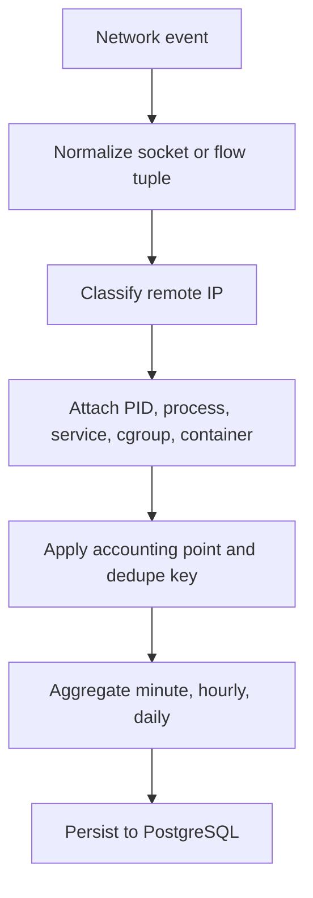

# Architecture

Network Monitor Debian is scoped first to server-generated traffic. It does not measure total household Internet usage unless a future router/gateway collector is enabled.

## Current Host Assumptions

Inspection on 2026-08-14 showed:

- Ethernet: `enp0s31f6` with `192.168.1.10/24` and `192.168.1.7/24`.
- Wi-Fi: `wlp1s0` with `192.168.1.6/24`.
- Default route: `default via 192.168.1.1 dev enp0s31f6`.
- Docker bridges: `172.17.0.0/16` through `172.21.0.0/16`.
- IPv4 forwarding: enabled, but the host default route still points to the router. This project must not assume the host is the LAN gateway.

## Chosen Stack

- Collector: Go daemon with eBPF/cgroup/socket collector planned for Phase 2.
- API: Go HTTP API initially. Keeping collector and API in Go reduces runtime weight and avoids a second backend stack.
- Frontend: React, TypeScript, Vite.
- Database: PostgreSQL. Native partitioned tables may be added when traffic volume justifies it.
- Cache: none initially. Redis is deferred until a concrete streaming or queueing need appears.

Primary sources used for the architecture decision:

- Linux kernel BPF program types and cgroup hooks: https://docs.kernel.org/bpf/libbpf/program_types.html
- Linux kernel cgroup BPF storage: https://docs.kernel.org/bpf/map_cgroup_storage.html
- Linux kernel socket local storage: https://docs.kernel.org/bpf/map_sk_storage.html
- Docker host network mode: https://docs.docker.com/engine/network/drivers/host/
- nftables counters: https://wiki.nftables.org/wiki-nftables/index.php/Counters
- nftables connection tracking overview: https://wiki.nftables.org/wiki-nftables/index.php/Connection_Tracking_System
- PostgreSQL partitioning: https://www.postgresql.org/docs/current/ddl-partitioning.html

## Feature Layout

```text
Network-Monitor-Debian/
├── apps/
│   ├── backend/
│   ├── collector/
│   └── frontend/
├── features/
│   └── network-usage/
├── infrastructure/
│   └── database/
├── deployments/
│   └── docker/
├── docs/
├── tests/
└── .github/
```

Gateway expansion is documented separately in [Optional Gateway Architecture](gateway-architecture.md). Gateway mode is optional and must not be enabled unless client traffic genuinely routes through the Debian server.

## Runtime Diagram

```mermaid
flowchart LR
  Kernel[Linux kernel network events]
  Proc[/host/proc and cgroups]
  Docker[Docker API metadata]
  Collector[privileged collector]
  DB[(PostgreSQL)]
  API[unprivileged API]
  Web[React web UI]

  Kernel --> Collector
  Proc --> Collector
  Docker --> Collector
  Collector --> DB
  API --> DB
  Web --> API
```

## Accounting Pipeline



## Phase Boundaries

Phase 1 creates the skeleton and the accounting contract. Phase 2 must implement host Internet accounting and prove:

- LAN transfer from server to `192.168.1.0/24` does not increase Internet totals.
- Public remote IP transfer does increase Internet totals.
- Docker bridge traffic is not double-counted across veth, bridge, and host NIC.
- Host-network services can still be attributed by PID/cgroup metadata.

## API Surface

Initial versioned endpoints:

- `GET /api/v1/health`
- `GET /api/v1/dashboard`

Planned endpoints:

- `GET /api/v1/network/realtime`
- `GET /api/v1/network/hourly`
- `GET /api/v1/network/daily`
- `GET /api/v1/devices`
- `GET /api/v1/devices/{id}`
- `GET /api/v1/isp-usage`
- `GET /api/v1/containers`
- `GET /api/v1/processes`
- `GET /api/v1/connections`
- `GET /api/v1/alerts`
- `GET /api/v1/reports/daily`
