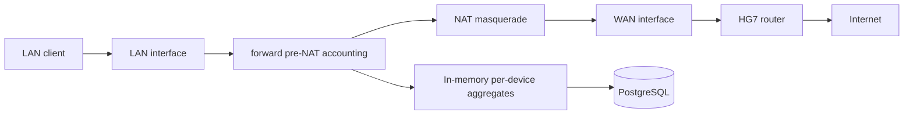

# Optional Gateway Architecture

Gateway mode is a future deployment mode for accurate per-LAN-device Internet usage. It is optional and must not be enabled automatically.

The current product remains valid in `server_only` mode: it monitors Internet usage generated by the Debian server itself and separates Internet, LAN, Docker internal, and loopback traffic.

## Current Completed Monitoring Features

The existing implementation already provides:

- Host/server Internet vs LAN classification.
- Docker internal CIDR classification.
- Loopback exclusion from Internet totals.
- nftables aggregate counters for authoritative host Internet/LAN totals.
- Conntrack snapshot fallback/diagnostic accounting with first-snapshot baseline behavior.
- PostgreSQL storage for raw samples plus minute, hourly, and daily aggregates.
- API endpoints for health, dashboard totals, and hourly network data.
- Frontend sections for network, containers, processes, connections, server health, alerts, reports, and settings.
- Tests for LAN/public/Docker/loopback classification and host flow direction accounting.

Gateway mode must preserve those behaviors.

## Accuracy Boundary

Per-device Internet usage is accurate only when client traffic actually traverses the Debian server as a gateway.

Passive observation on the existing LAN must not claim accurate per-device ISP totals because switched Ethernet/Wi-Fi traffic may not be visible to the server, NAT may hide client identity, and local LAN transfers can look large without being ISP usage.

Supported conceptual modes:

- `server_only`: existing behavior. Only Debian server generated traffic is monitored.
- `gateway`: LAN clients use Debian as their default gateway. Per-device Internet accounting is enabled.

The UI and API must expose the active mode and show reduced accuracy when gateway mode is not active.

## Preferred Production Topology

```text
                     INTERNET
                         |
                    Tenda HG7
                    192.168.1.1
                         |
              WAN side: 192.168.1.10
                   Debian Server
                 Gateway / Monitor
              LAN side: 192.168.50.1/24
                         |
                Monitored LAN / Wi-Fi
                         |
          +--------------+--------------+
          |              |              |
        Phone            TV           Laptop
     192.168.50.21  192.168.50.22  192.168.50.30
```

Recommended production setup uses two interfaces:

- WAN-side interface connected to the existing HG7 LAN.
- LAN-side interface connected to the monitored client network.

Current read-only inspection on 2026-08-15:

- `enp0s31f6`: up, `192.168.1.10/24` and `192.168.1.7/24`.
- `wlp1s0`: up, `192.168.1.6/24`.
- Default route: `192.168.1.1` via `enp0s31f6`, plus lower-priority Wi-Fi default route.
- IPv4 forwarding: enabled.
- IPv6 forwarding: disabled.
- Docker bridges: `172.17.0.0/16` through `172.24.0.0/16` are present.
- Wi-Fi AP mode support was not verified because `iw` is not installed in this environment.

Recommendation: use `enp0s31f6` as WAN-side only if SSH reachability and routing are preserved, and prefer a USB Gigabit Ethernet adapter for the monitored LAN side. Do not assume `wlp1s0` can run AP mode until `iw list` confirms AP support and coexistence with current Wi-Fi use is acceptable.

## Required Preflight Checks

Gateway deployment tooling must be read-only until explicit approval.

Before applying any network change:

1. Detect the current SSH client and server addresses from environment/process metadata.
2. Inspect interfaces, addresses, routes, and link state.
3. Detect Docker bridge CIDRs and existing nftables tables.
4. Detect existing DHCP/DNS services, including Pi-hole.
5. Verify the proposed LAN CIDR does not overlap WAN, Docker, VPN, or existing LAN routes.
6. Verify candidate LAN interface is not the current SSH path.
7. Generate proposed IP forwarding, nftables, NAT, DHCP, and DNS configuration.
8. Validate syntax without applying.
9. Present a diff and rollback command set.
10. Request explicit approval.

The application must not reboot the server automatically.

## Accounting Point

Gateway traffic must be attributed before source NAT changes the original client address.

Selected first implementation path:

- Use nftables/conntrack on the forwarding path for aggregate per-device accounting.
- Count at a single authoritative hook: pre-NAT forward accounting.
- Use source MAC/IP from the monitored LAN side plus conntrack tuple metadata.
- Flush aggregated deltas periodically to PostgreSQL.
- Keep interface counters as reconciliation only.

Potential future enhancement:

- eBPF hooks can improve per-flow metadata and realtime streaming, but the initial gateway design should not require packet-level database writes.

Do not count the same forwarded packet at LAN ingress and WAN egress. The collector must select one authoritative accounting point per mode.



## Traffic Classification Rules

For gateway mode:

- Client to public remote IP: `internet`, counts as measured ISP usage.
- Client to monitored LAN CIDR: `lan`, does not count as ISP usage.
- Client to server LAN IP: `server_local`, does not count as ISP usage.
- Docker bridge to Docker bridge: `docker_internal`, does not count as ISP usage.
- Server host socket to public IP: `internet`, source is `host/server`.
- Unknown or invalid records: `unknown`, not counted as ISP usage unless a future explicit policy says otherwise.

LAN Plex/Samba/Home Assistant traffic must not increase Internet totals.

## Device Identity

Persistent device identity is MAC-first:

```text
MAC -> persistent device ID
IP -> current lease/address only
hostname -> label evidence
friendly name -> user-managed display name
type -> user-managed or inferred display type
```

IP-only identity is ephemeral and must be shown as unknown/unconfirmed. When DHCP changes a device from `192.168.50.21` to `192.168.50.44`, history follows the MAC-backed device ID.

Planned tables:

- `devices`: stable device record keyed by generated ID.
- `device_observations`: MAC/IP/hostname/lease evidence over time.
- `device_usage_minute`, `device_usage_hourly`, `device_usage_daily`: per-device aggregates.
- `device_usage_monthly`: monthly rollup or materialized query.

## DHCP and DNS

Recommended initial DHCP/DNS component: `dnsmasq`.

Reasons:

- Simple deployment for a single monitored LAN.
- DHCP leases and DNS query logs are easy to correlate.
- Can forward DNS to Pi-hole or use Pi-hole as upstream.

Rules:

- Never run two DHCP servers on the same subnet.
- Do not enable DHCP on `192.168.1.0/24` while HG7 is serving DHCP there.
- Run DHCP only on the monitored LAN interface/subnet, for example `192.168.50.0/24`.
- If Pi-hole already provides DHCP, either integrate with Pi-hole lease data or keep Pi-hole DHCP disabled on the monitored subnet.

DNS query correlation can improve service classification, but it is evidence, not proof. The UI must display confidence.

## Docker Coexistence

The server hosts Docker applications, so gateway mode must not disturb Docker NAT/routing.

Known conflict areas:

- Docker uses bridge CIDRs in `172.17.0.0/16` through `172.24.0.0/16` on this host.
- Docker installs NAT/filter rules. Network Monitor rules must live in isolated tables/chains and must not flush global rules.
- Published ports for Plex, qBittorrent, pyLoad, Samba-adjacent services, Pi-hole, Home Assistant, and other containers must remain reachable according to existing deployment.
- Docker internal bridge traffic must not be attributed to a LAN client.

Gateway nftables rules must be idempotent, named, and removable independently:

```text
inet network_monitor_gateway
  set monitored_lan4
  set docker4
  counter device/accounting maps
  chain forward_prenat_account
  chain wan_nat
```

The final rule generator must use `nft -c` validation before applying.

## ISP Usage Windows

Measured usage is split by configurable package windows.

Default:

```text
Timezone: Asia/Colombo
Free/Night: 00:00-07:00
Anytime: 07:00-24:00
```

These values are defaults only. Settings must allow changing the timezone and boundaries. Bucket assignment must use the transfer timestamp converted from UTC to the configured timezone.

UI labels must say `Measured Usage`, not exact ISP billing.

## Service Classification Honesty

Gateway mode must not decrypt HTTPS, install fake certificates, or store packet contents.

Service/category classification may use:

- DNS query correlation.
- SNI when available without interception.
- Known IP/ASN/provider rule modules.
- Protocol metadata.

Confidence levels:

- `high`
- `medium`
- `low`
- `unknown`

If evidence is weak, display `Encrypted HTTPS / Unknown`.

Provider/category rules should live in maintainable modules, not hard-coded deep in the collector.

## Alerts and Notifications

Initial alert model:

- Daily device Internet threshold.
- Anytime threshold.
- Burst threshold over short windows.
- Unknown device threshold.
- New unknown device joined.
- Category-aware social/video threshold.

Unknown encrypted traffic behavior must be configurable. Excluding known downloads must not also suppress unknown traffic unless the user explicitly configures it.

Notification providers should be modular:

- dashboard
- browser notification
- Telegram
- email
- Discord
- webhook

## Migration Plan

1. Keep the existing server-only deployment running.
2. Add read-only gateway preflight command/API.
3. Add database migrations for devices, observations, gateway samples, ISP windows, and category evidence.
4. Add UI mode indicator and read-only gateway readiness panel.
5. Add a lab-only gateway config generator.
6. Validate on an isolated test subnet with one disposable client.
7. Validate LAN-only transfer does not count as Internet.
8. Validate public transfer counts once for the correct MAC-backed device.
9. Validate Docker services and published ports still work.
10. Move selected devices to the monitored LAN.
11. Only after validation, consider making the monitored LAN the default client network.

## Rollback Plan

Every gateway apply step must generate rollback instructions before making changes:

- Disable Network Monitor nftables gateway table only.
- Disable DHCP service on the monitored LAN.
- Restore previous IP forwarding setting if Network Monitor changed it.
- Restore previous interface addresses/routes if Network Monitor changed them.
- Move clients back to HG7 Wi-Fi/LAN or previous DHCP network.
- Verify SSH path remains reachable before ending the apply command.

Rollback must not flush Docker or system firewall rules outside Network Monitor-owned tables.

## First Implementation Milestones

1. Architecture and accounting model tests.
2. Database schema for devices and ISP windows.
3. API read models for devices and ISP usage.
4. UI `Devices` and `ISP Usage` sections using real persisted data.
5. Read-only gateway readiness checker.
6. nftables gateway rule generator with dry-run validation.
7. Lab-only collector mode for per-device aggregates.
8. SSE/WebSocket realtime bandwidth feed.
